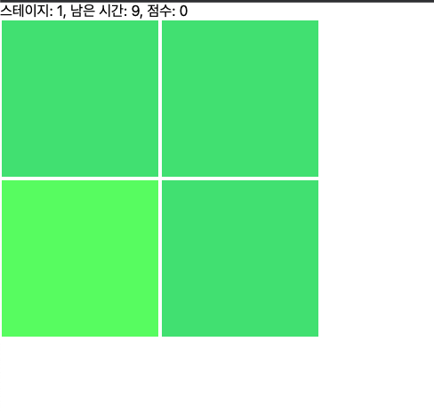
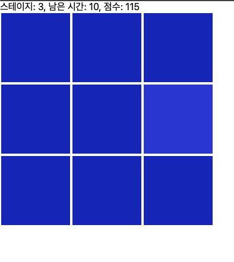

[x] Math.pow(Math.floor((stage/2) + 1), 2)개의 사각형이 표시되며, 그 중 하나만 색깔이 다릅니다.
[x] 한 stage의 제한 시간은 15초입니다.
[] 색이 다른 사각형(정답)을 클릭한 경우 아래 변경사항이 적용됩니다.
  [x] 다음 스테이지로 넘어갑니다.
  [] stage * stage * 남은시간 만큼의 score가 누적됩니다.
[x] 오답을 클릭한 경우 아래 변경사항이 적용됩니다.
  [x] 현재 stage의 남은 시간이 3초 줄어듭니다.
[] 남은 시간이 0초 이하가 되면 게임이 종료됩니다. 최종 stage와 누적 score를 출력하고, 새로운 게임을 시작할 수 있습니다.
[] stage가 올라갈수록 정답과 오답의 색상 차이가 줄어듭니다.

다음의 조건에 맞게 진행해주세요
1. React Framework를 사용할 것
2. Function Component를 활용할 것
3. Javascript보다는 Typescript를 활용할 것
4. 서버에 배포할 것 (Vercel과 같은 서비스를 이용해보세요)
5. **Context, Redux, Mobx, Recoil** 등 상태관리 도구를 사용하지 않을 것

* 점수 확인 후 게임 새로 시작

